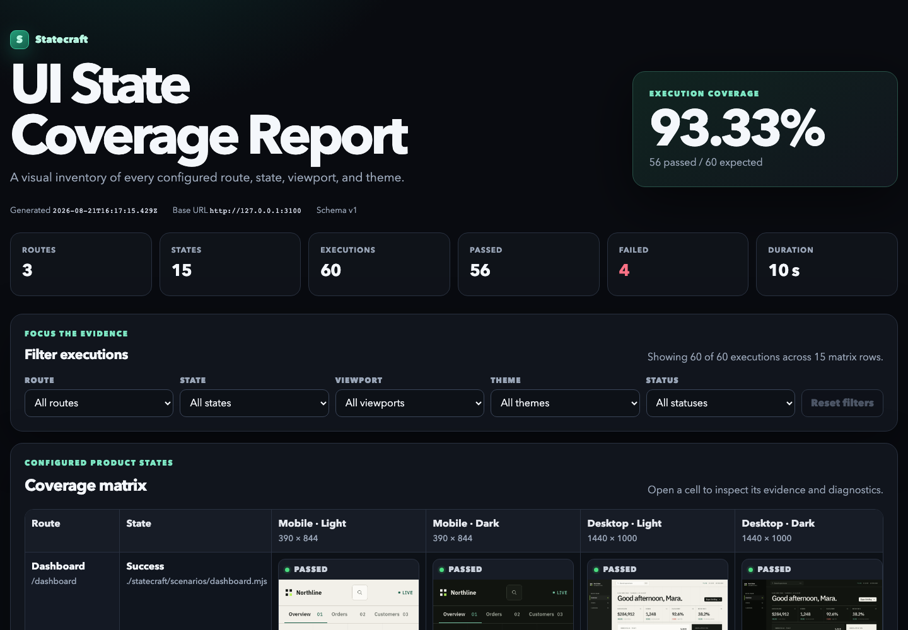
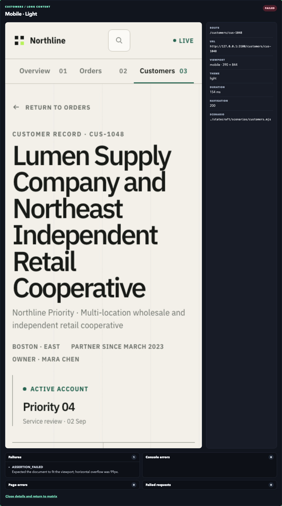

# Statecraft

[](https://github.com/RujitRaval/statecraft/actions/workflows/ci.yml)
[](https://www.npmjs.com/package/statecraft-ui)
[](LICENSE)

**Find the UI states your product forgot.**

Statecraft is a local-first product-state coverage tool. It renders your routes across meaningful states, viewports, and themes; runs assertions; captures screenshots and sanitized diagnostics; and produces one self-contained offline report.

```bash
npm install --save-dev statecraft-ui playwright@1.62.1
npx playwright install chromium
npx statecraft init
npx statecraft scan
```



The screenshot above is the real 60-cell Northline example report. Four deliberately broken coordinates remain visible so the release gate proves Statecraft catches narrow-viewport overflow and theme-specific contrast failures.

## Product states, not just pixel changes

Conventional visual regression asks whether an existing screenshot changed. Statecraft asks whether every important product state still works in the conditions you support.

| | Statecraft | Screenshot regression |
| --- | --- | --- |
| Primary question | Did each configured product state survive? | Did pixels change from a baseline? |
| Coverage model | Route × state × viewport × theme | Screenshot cases you remembered to write |
| Evidence | Screenshot, assertions, console/page/request diagnostics | Image diff |
| Output | Private local JSON, PNGs, and offline HTML | Usually service- or runner-specific |

Use it for loading, empty, error, unauthorized, long-content, responsive, and theme states—the places where otherwise healthy applications tend to break.

## Quick start

Statecraft supports Node.js 22.20 or newer within the Node 22 LTS line, or Node.js 24.x.

1. Install the CLI and its pinned browser runtime:

   ```bash
   npm install --save-dev statecraft-ui playwright@1.62.1
   npx playwright install chromium
   ```

2. Generate an overwrite-safe starter config and scenario:

   ```bash
   npx statecraft init
   ```

   This creates `statecraft.config.mts` and `statecraft/scenarios/home/success.mts`. The explicit ESM extensions work in both npm's default CommonJS projects and projects that set `"type": "module"`.

3. Start your application, then scan and open the report:

   ```bash
   npx statecraft scan
   npx statecraft open
   ```

`scan` exits `0` when all cells pass, `1` when completed cells expose product-state failures, and `2` for setup or configuration errors. A failing scan still writes its report whenever execution completed.

## Configure a small, explicit matrix

```ts
import { defineConfig } from "statecraft-ui";

export default defineConfig({
  baseURL: "http://127.0.0.1:3000",
  routes: [
    {
      id: "orders",
      path: "/orders",
      states: ["success", "loading", "empty", "error"].map((id) => ({
        id,
        setup: "./statecraft/scenarios/orders.mjs",
      })),
    },
  ],
  themes: ["light", "dark"],
  viewports: {
    mobile: { width: 390, height: 844 },
    desktop: { width: 1440, height: 1000 },
  },
});
```

Scenarios are trusted local modules. They can intercept deterministic API responses, wait for product-specific readiness, and make assertions with the same Playwright page used for capture:

```js
export default {
  async beforeNavigate({ page, state }) {
    if (state.id === "empty") {
      await page.route("**/api/orders", (route) =>
        route.fulfill({ json: { orders: [] }, status: 200 }),
      );
    }
  },
  async afterNavigate({ page }) {
    await page.locator("[data-orders-state]").waitFor();
  },
  async assert({ page }) {
    await page.getByRole("heading", { name: "Orders" }).waitFor();
  },
};
```

See the [CLI and configuration specification](docs/product/CLI_AND_CONFIG_SPEC.md), [runner API](docs/engineering/RUNNER_API.md), and complete [Northline matrix](apps/example-nextjs/statecraft.config.ts).

## Inspect evidence offline

Every completed scan writes a versioned report beneath `.statecraft/`:

```text
.statecraft/
├── artifacts/        # deterministic PNG evidence
└── report/
    ├── index.html    # self-contained interactive report
    └── statecraft.json
```

Filter by route, state, viewport, theme, or status. Open a cell to inspect the exact screenshot, route metadata, assertion failures, console errors, page errors, and failed requests. The report needs no server, account, network request, or external asset.



## GitHub Actions

Statecraft is a normal CLI job; no custom Marketplace action or hosted service is required. The copy-ready [GitHub Actions guide](docs/open-source/GITHUB_ACTIONS.md) covers application readiness, Chromium installation, exit codes, privacy, and uploading the complete `.statecraft` bundle with `if: always()` so failures retain their evidence.

Reports can contain screenshots, URLs, and application data. Treat artifacts from a public repository as public, use only fictional or approved test data, and choose the shortest useful retention period.

## Packages

| Package | Purpose |
| --- | --- |
| [`statecraft-ui`](https://www.npmjs.com/package/statecraft-ui) | Public API and the `statecraft` executable |
| [`statecraft-ui-core`](https://www.npmjs.com/package/statecraft-ui-core) | Browser-independent config, matrix, coverage, and report contracts |
| [`statecraft-ui-runner-playwright`](https://www.npmjs.com/package/statecraft-ui-runner-playwright) | Isolated Playwright execution and local persistence |
| [`statecraft-ui-report`](https://www.npmjs.com/package/statecraft-ui-report) | Deterministic offline report transformation and rendering |

All four packages publish from the protected GitHub Release workflow through npm trusted publishing with provenance. No long-lived npm token remains configured.

## Local-first architecture

```text
configure → expand matrix → run isolated browser cells → persist evidence → inspect report
```

- No telemetry, hosted backend, database, account, cloud dependency, or required LLM.
- One Chromium process is reused while every matrix cell gets a fresh browser context and page.
- Screenshot paths, result schemas, coverage math, and report rendering are deterministic.
- Console, page, and request diagnostics are sanitized before persistence.
- `.statecraft/` is ignored because reports may contain sensitive application data.

Read the [architecture](docs/architecture/ARCHITECTURE.md), [security and privacy model](docs/engineering/SECURITY_PRIVACY.md), and [report UX specification](docs/product/REPORT_UX_SPEC.md) for the detailed contracts.

## Develop and contribute

The workspace uses pnpm, strict TypeScript, Vitest, Playwright, and a polished Next.js fixture:

```bash
corepack pnpm install --frozen-lockfile
corepack pnpm --filter statecraft-ui-runner-playwright exec playwright install chromium
corepack pnpm lint
corepack pnpm typecheck
corepack pnpm test
corepack pnpm build
```

The Northline scan intentionally exits `1` with exactly 56 passes and four failures. To regenerate the checked-in launch images after producing that report, run `corepack pnpm launch:assets`.

Start with [CONTRIBUTING.md](CONTRIBUTING.md). The [documentation map](codex/MASTER_PROMPT.md), [implementation specification](codex/IMPLEMENTATION_SPEC.md), [release guide](docs/open-source/RELEASING.md), and [launch strategy](docs/open-source/LAUNCH_STRATEGY.md) explain the product boundary and workflow.

## Roadmap

The current release is the local-first v0.1 product: explicit matrices, deterministic Playwright scenarios, offline evidence, CI usage, and a complete example. Potential follow-ups include Storybook and MSW helpers, richer assertions, accessibility metadata, PR summaries, and additional framework adapters. Hosted collaboration remains out of scope unless real demand appears.

## License

[MIT](LICENSE)
